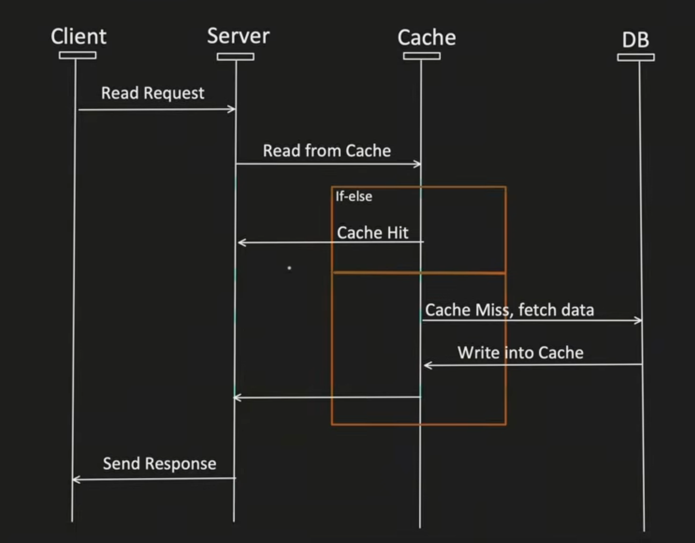

# Cache Aside / Lazy Loading Flow

- The application first checks the cache.
- If the data is found in the cache, it is called a **Cache Hit**, and the data is immediately returned to the client.
- If the data is not found in the cache, it is called a **Cache Miss**.
  - The application fetches the data from the database.
  - The fetched data is stored in the cache.
  - The data is then returned to the client.

---

---

## Pros

- Good approach for **heavy read** applications.
- Even if the cache is down, the request will not fail, as it can fetch the data directly from the database.
- The cached document/data structure can be different from the data structure stored in the database.

## Cons

- For newly requested data, there will always be a **cache miss** on the first read.
  - *To resolve this, the cache can be pre-warmed (pre-heated).*
- If the write operation does not properly update or invalidate the cache, there is a risk of **data inconsistency** between the cache and the database.