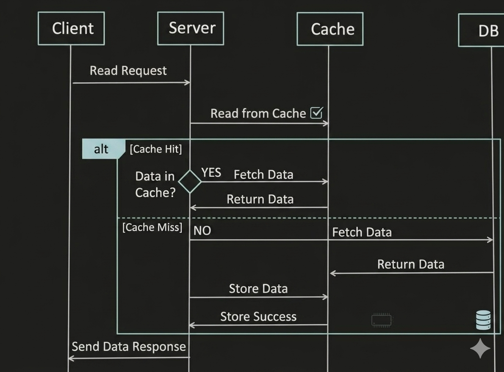

# Cache Aside / Lazy Loading Flow

- Application first check the cache.If data found in Cache, it's called Cache Hit and data is returned to the client.

- If Data is not found in Cache, its called Cache Miss.

- Cache Library itself fetch the data from DB store it back to Cache and data is returned to the application.

---

---

## Pros

- Good approach for Heavy Read application.

- Logic of fetching the data from DB and updating Cache is separated from the application.

## Cons

- For new data read, there will always be CACHE-MISS first. (to resolve this, generally we can pre-heat the cache)

- Without appropriate caching is not used during Write operation.

- There is a chance of Inconsistency between Cache and DB.Cache Document structure should be same as DB table.
