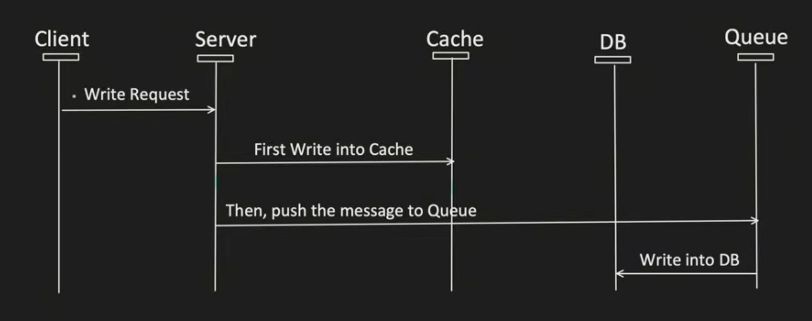

# Write Back / Behind

- First write data into cache
- Asynchronously write data into DB

---

---

## Pros

- Good for Write heavy application.
- Improves the Write operation Latency.
- Writing into the DB happens asynchronously.
- Cache Hit chance increases a lot.
- Gives much better performance when used with read through cache.

## Cons

- Even when DB fails, Write operation will still work. (Note: This is listed under CONS in the image, but it acts as a benefit with a risk of data loss if the cache crashes before syncing).

- If Data is removed from Cache and DB write has not happened yet, there is a chance of data loss.

- This is handled by keeping the TTL / TAT of the cache higher (like 2 days).
