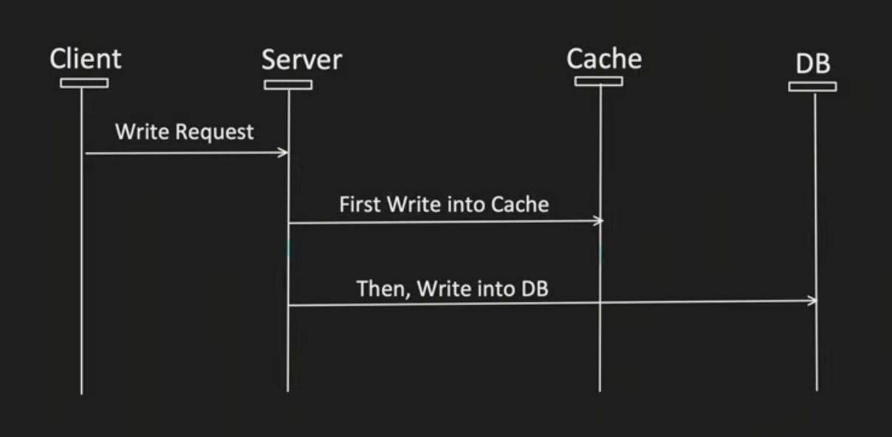

# Write Through

- First write data into cache
- Then synchronous write data into DB
- If DB or cache fail rollback the transactions

---

---

## Pros

- Good approach for Heavy Read application.

- Resolves Inconsistency problem between Cache and DB.

## Cons

- For new data read, there will always be CACHE-MISS first. (to resolve this, generally we can pre-heat the cache)

- If DB is down, Write operation will fail.
